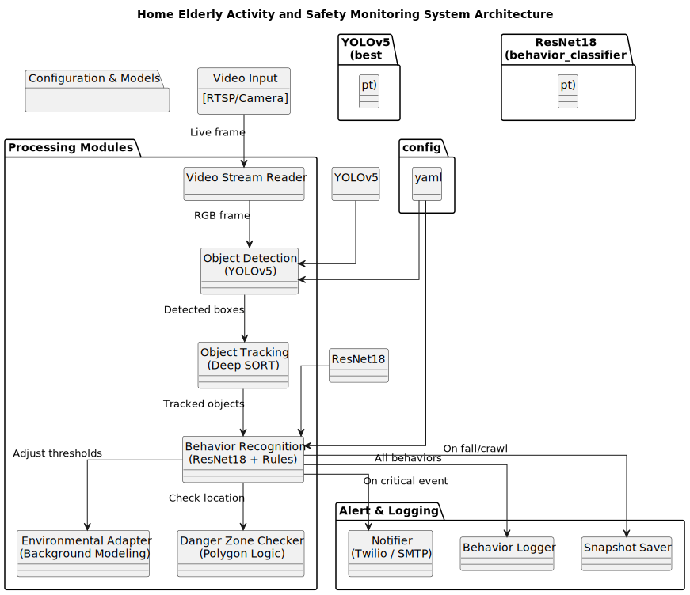

# Home Elderly Activity and Safety Monitoring System

## Introduction

This is a real-time Human Activity Recognition (HAR) system designed for home-based elderly care. This project aims to monitor the activities of elderly individuals at home to ensure their safety and well-being. It primarily focuses on detecting dangerous events, such as falls, and notifying family members immediately via SMS or email alerts. Additionally, it tracks regular daily activities, such as eating, sleeping, sitting, and moving, to help caregivers better understand the elderly’s routines.

When critical events (like a fall) are detected, the system can immediately notify caregivers via SMS or email, and log the incident with visual snapshots and behavior reports for review and intervention. By leveraging state-of-the-art computer vision algorithms, pre-trained models, and configurable modules, this system provides reliable real-time monitoring with minimal user intervention.

## What Makes This System Different?

Unlike traditional vision pipelines that only detect objects (e.g., using YOLO), this system:
* Performs full Human Activity Recognition using temporal and spatial cues.
* Understands not just where someone is, but what they are doing and why it may be risky.
* Integrates rule-based logic with deep learning to analyze context: Is this person sleeping, or unconscious? Are they eating, or are they unresponsive?
* Adapts to different home environments, lighting conditions, and behavior patterns dynamically.

## Core Features

1. Activity Recognition & Classification
   * Uses a fine-tuned ResNet18 model to classify human activities.
   * Recognized behaviors include:
     * Sitting
     * Lying down / Sleeping
     * Eating
     * Crawling
     * Running
     * Falling (detected via both model and geometric heuristics)

2. Real-Time Multi-Target Tracking
   * Uses YOLOv5 + Deep SORT to track multiple people in the frame and assign consistent IDs.

3. Contextual Risk Analysis
   * Identifies specific persons (via re-ID embedding).
   * Evaluates danger zone violations, unusual postures, and static behavior duration to infer risks.

4. Automatic Alerts
   * Sends real-time SMS or email alerts to caregivers when critical events occur (e.g., fall, entering danger zone).
   * Captures snapshots of the moment for review.

5. Activity Timeline Reporting
   * Logs daily activity behaviors per person.
   * Provides behavior frequency and duration stats.

## Human Activity Recognition


## Architecture



## Technologies Used

| Category          | Technology / Tool                          |
|-------------------|-------------------------------------------|
| Detection         | YOLOv5 (PyTorch)                          |
| Tracking          | Deep SORT                                 |
| Activity Model    | ResNet18 (fine-tuned on Kinetics / custom)|
| Vision Processing | OpenCV                                    |
| Geometric Analysis| Shapely (for region / polygon checks)     |
| Notifications     | Twilio API (SMS), SMTP (Email)            |
| Other             | YAML config, snapshot logging             |


 
## Training Data and Models
* Pretraining Dataset: Kinetics-400
* Custom Fine-Tuning:
  * Home surveillance videos labeled with behavior (sitting, lying, etc.)
  *    Fall simulation clips
* Trained Models:
  * models/yolov5/best.pt: Person detector
  * models/behavior/behavior_classifier.pt: HAR classifier (ResNet18)

## Setup Instructions

Prerequisites

* Python 3.8+
* A GPU with CUDA support (optional, for real-time performance)


```
pip install -r requirements.txt
```

## Usage

```
python main.py
```
* Uses RTSP stream or webcam by default.
* Visualizes detections, behaviors, and danger zone violations.
* Saves logs and snapshots under data/outputs/.

## Extending the System

Adding New Behaviors

	1.	Collect labeled data for the new behavior.
	2.	Fine-tune the ResNet18 model using the labeled data.
	3.	Update class_names in config.yaml to include the new behavior.

Adding New Danger Zones

	1.	Define the new danger zone as a polygon.
	2.	Update the danger_zones field in config.yaml.

Customizing Notifications

	1.	Edit the notification section in config.yaml to configure SMS and email alerts.
	2.	Use the notification.py module to add new notification channels (e.g., push notifications).


## Real-World Scenario

### Example Case:
* Grandma falls in the living room → system detects a fall (height drop + lying pose + no movement).
* SMS sent to daughter:
### URGENT: Possible FALL detected at 12:31pm in Living Room. Snapshot saved.
* Snapshot auto-saved and behavior log updated.

## FAQs

Q: Does this system only detect falls?

A: No — it also detects everyday activities and tracks long-term behavioral patterns (sitting, eating, etc.).

Q: How does the system detect dangerous events?

A: The system uses YOLOv5 to detect human targets and a ResNet18 classifier to recognize behaviors like falls. It dynamically adjusts detection thresholds for reliability.

Q: What happens when a fall is detected?

A: When a fall is detected:
	1.	An SMS or email is sent to the family member.
	2.	A snapshot of the event is saved for later review.

Q: Can I use a different camera?

A: Yes, the system supports both USB webcams and RTSP streams. Update the camera source in main.py. 
